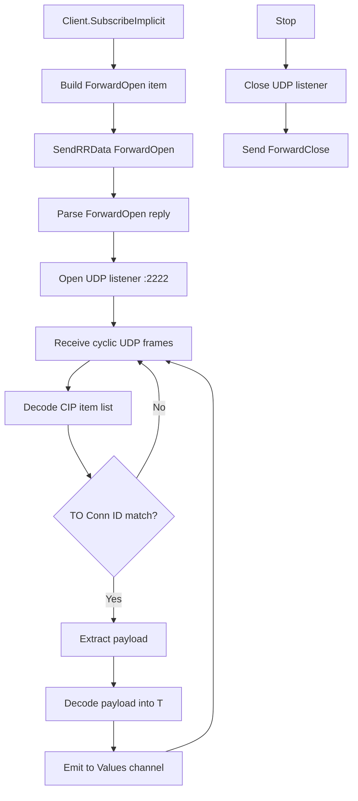

# Class1 Implicit Client Blueprint

This document describes the minimal client-side implicit I/O subscription architecture added to this repository.

## Scope

Implemented now:
- Open a dedicated Class1 forward-open connection from the existing client TCP session.
- Receive cyclic UDP I/O packets.
- Filter packets by TO connection ID for the subscription.
- Decode payload into a typed Go value.
- Stop subscription and issue forward-close.
- Build common assembly-style Class1 connection paths with a typed helper.
- Build Produced/Consumed Tag style Class1 connection paths with a typed helper.
- Allow overriding Forward Open transport trigger for device compatibility.

Not implemented yet:
- Full Assembly path coverage for vendor-specific or keying-heavy topologies.
- Per-subscription UDP port multiplexing strategy beyond default `:2222`.
- Run/Idle and sequence diagnostics surfaced to caller.
- Connection watchdog/reconnect loop for long-running subscriptions.

## Data Flow



## Module Layout

- `implicit_subscribe.go`
  - `ImplicitSubscriptionConfig`
  - `ImplicitAssemblyPathConfig`
  - `CIPConnectionPoint`
  - `BuildImplicitAssemblyPath`
  - `ImplicitProducedConsumedPathConfig`
  - `BuildImplicitProducedConsumedPath`
  - `NewProducedConsumedPathDefault`
  - `NewABGenericEthernetModuleAssemblyPath`
  - `NewABGenericEthernetModuleAssemblyPathPtr`
  - `NewABGenericEthernetModuleAssemblyPathDefault`
  - `ImplicitSubscription[T]`
  - `SubscribeImplicit[T]`
  - `Client.SubscribeImplicitBytes`
  - `Client.forwardOpenCustom`
  - `Client.forwardCloseBySerial`

- `examples/ImplicitSubscribe/main.go`
  - Minimal usage sample.

## API Sketch

```go
sub, err := gologix.SubscribeImplicit[MyInput](client, gologix.ImplicitSubscriptionConfig{
    RPI:           200 * time.Millisecond,
    ListenAddress: ":2222",
})

for v := range sub.Values {
    // use v
}

_ = sub.Stop()
```

Real hardware assembly path usage:

```go
sub, err := gologix.SubscribeImplicit[MyInput](client, gologix.ImplicitSubscriptionConfig{
  RPI:              100 * time.Millisecond,
  TransportTrigger: 0xA3,
  AssemblyPath:     gologix.NewABGenericEthernetModuleAssemblyPathDefault(),
})
```

Template helper details:
- `NewABGenericEthernetModuleAssemblyPath(output, input, config)`
- `NewABGenericEthernetModuleAssemblyPathPtr(output, input, config)`
- `NewABGenericEthernetModuleAssemblyPathDefault()` uses 150/100/151.
- Pass `config=0` to omit config assembly instance.

Produced/Consumed path usage:

```go
sub, err := gologix.SubscribeImplicit[MyInput](client, gologix.ImplicitSubscriptionConfig{
  RPI:              100 * time.Millisecond,
  TransportTrigger: 0xA3,
  ProducedConsumedPath: gologix.NewProducedConsumedPathDefault("Program:Main.MyConsumedTag"),
})
```

Connection path precedence in `ImplicitSubscriptionConfig`:
1. `ConnectionPath`
2. `ProducedConsumedPath`
3. `AssemblyPath`
4. `client.Controller.Path`

## Next Iteration Recommendations

1. Add coverage for keying-heavy vendor-specific connection path variants.
2. Add reconnect strategy with jittered backoff and health state callbacks.
3. Add metrics counters (packets, drops, decode errors, stale timer).
4. Add integration test against local `examples/Server_Class1` harness.
